---
## Front matter
lang: ru-RU
title: Лабораторная работа №1
subtitle: Моделирование сетей передачи данных
author:
  - Исаев Б.А.
institute:
  - Российский университет дружбы народов имени Патриса Лумумбы, Москва, Россия
date: 2024

## i18n babel
babel-lang: russian
babel-otherlangs: english

## Formatting pdf
toc: false
toc-title: Содержание
slide_level: 2
aspectratio: 169
section-titles: true
theme: metropolis
header-includes:
 - \metroset{progressbar=frametitle,sectionpage=progressbar,numbering=fraction}
 - '\makeatletter'
 - '\beamer@ignorenonframefalse'
 - '\makeatother'
---

## Докладчик

  * Исаев Булат Абубакарович
  * Студент группы НПИбд-01-22
  * Студ. билет 1132227131
  * Российский университет дружбы народов имени Патриса Лумумбы

## Цель лабораторной работы

- Развернуть в системе виртуализации (например, в VirtualBox) 
mininet, познакомиться с основными командами для работы с Mininet через командную строку и 
через графический интерфейс.

# Выполнение лабораторной работы

## Настройка образа VirtualBox

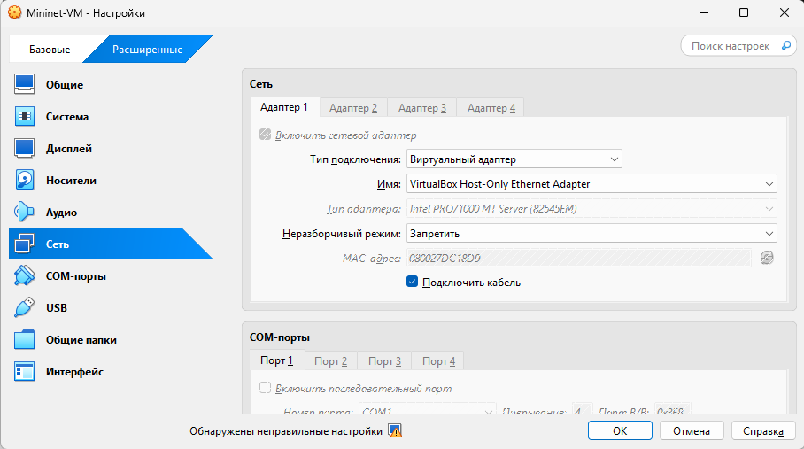{ #fig:001 width=80% height=80% }

##  Подключение к виртуальной машине

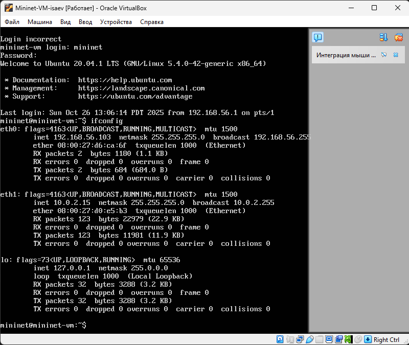{ #fig:002 width=80% height=80% }

##  Подключение к виртуальной машине

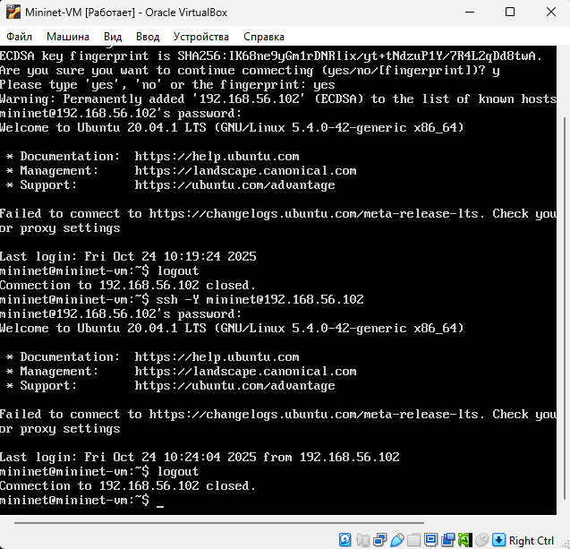{ #fig:003 width=80% height=80% }

## Работа с Mininet из-под Windows

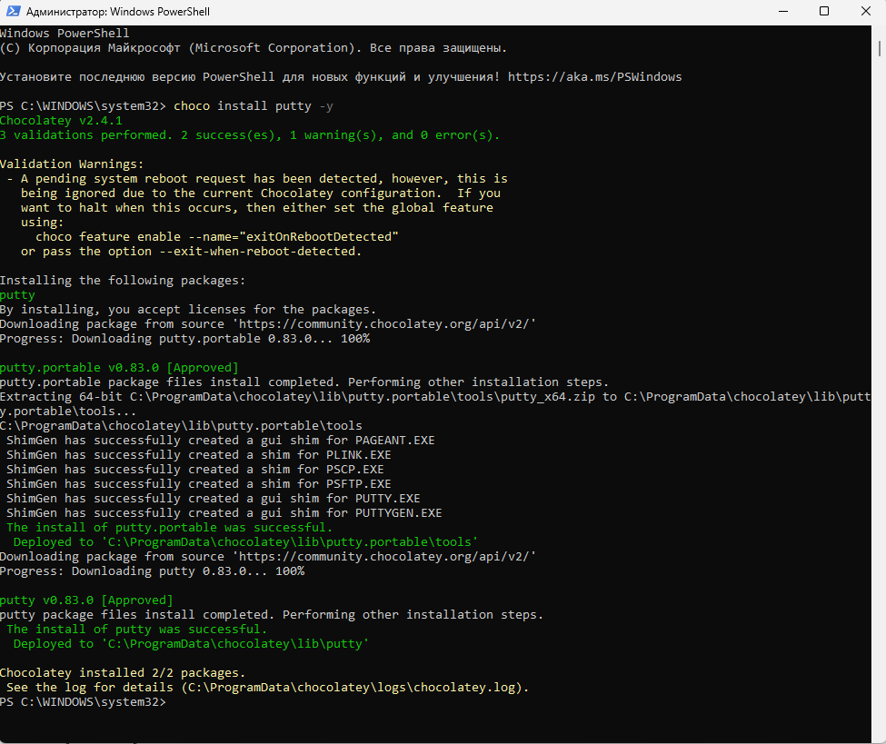{ #fig:004 width=80% height=80% }

## Работа с Mininet из-под Windows

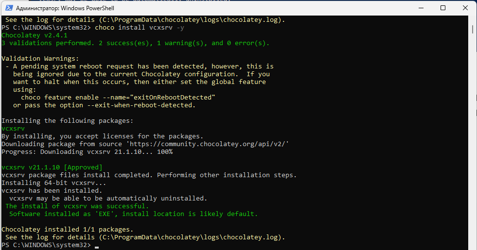{ #fig:005 width=100% height=100% }

## Работа с Mininet из-под Windows

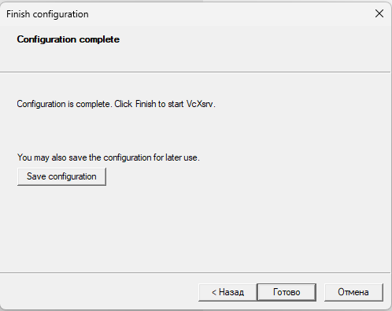{ #fig:006 width=80% height=80% }

## Работа с Mininet из-под Windows

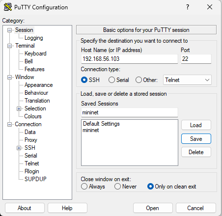{ #fig:007 width=80% height=80% }

## Настройка параметров XTerm

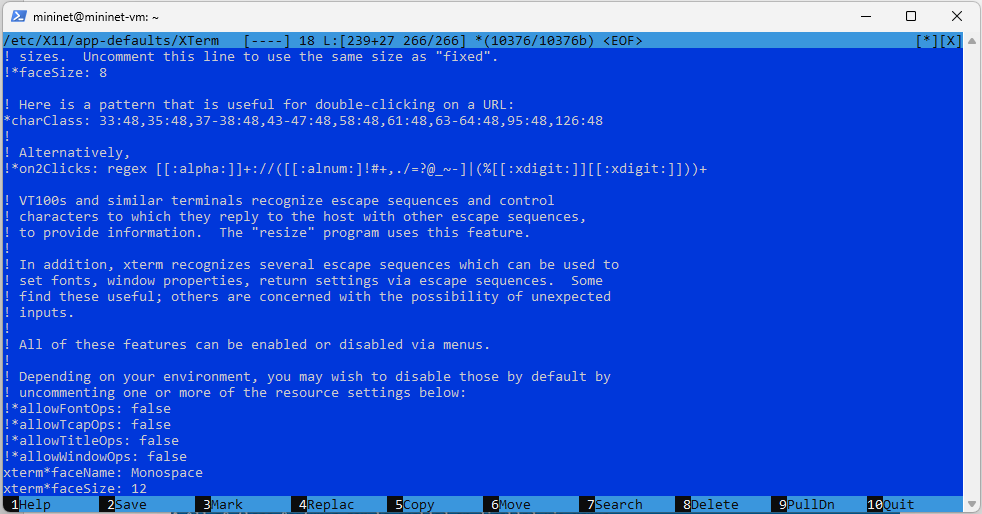{ #fig:008 width=80% height=80% }

## Настройка соединения X11 для суперпользователя

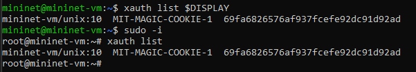{ #fig:009 width=100% height=100% }

## Работа с Mininet с помощью командной строки

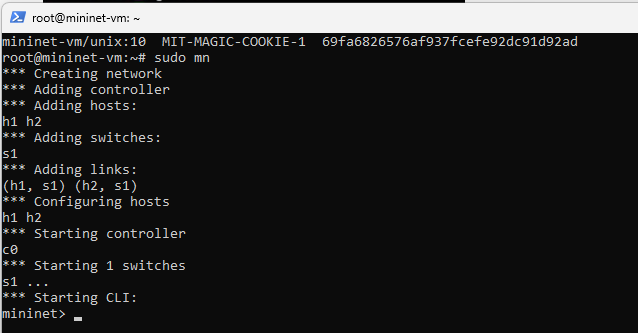{ #fig:010 width=80% height=80% }

## Работа с Mininet с помощью командной строки

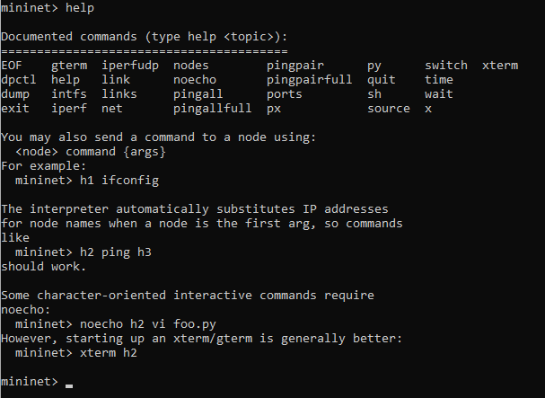{ #fig:011 width=80% height=80% }

## Работа с Mininet с помощью командной строки

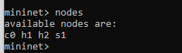{ #fig:012 width=100% height=100% }

## Работа с Mininet с помощью командной строки

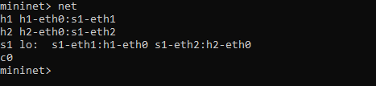{ #fig:013 width=100% height=100% }

## Работа с Mininet с помощью командной строки

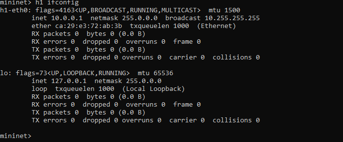{ #fig:014 width=90% height=90% }

## Работа с Mininet с помощью командной строки

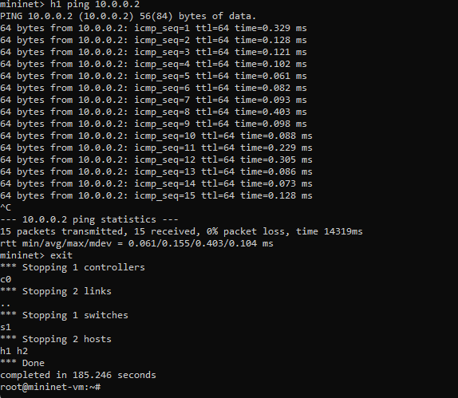{ #fig:015 width=80% height=80% }

## Работа с Mininet с помощью командной строки

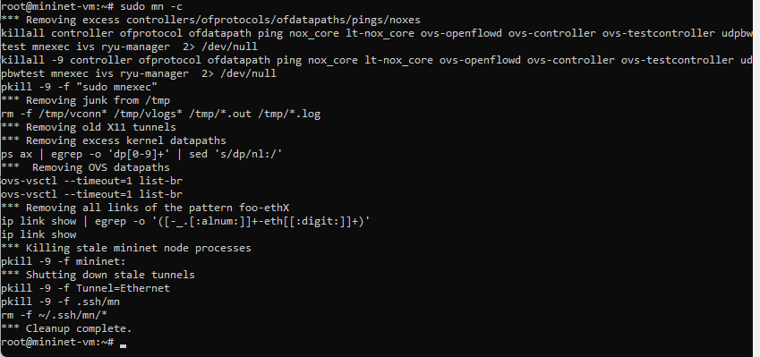{ #fig:016 width=100% height=100% }

## Построение и эмуляция сети в Mininet с использованием графического интерфейса

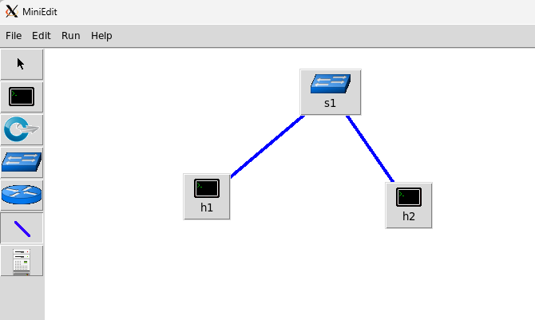{ #fig:017 width=80% height=80% }

## Построение и эмуляция сети в Mininet с использованием графического интерфейса

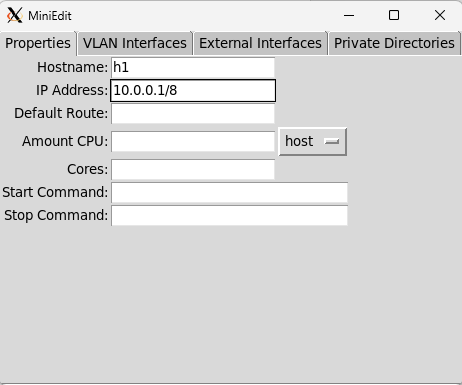{ #fig:018 width=80% height=80% }

## Построение и эмуляция сети в Mininet с использованием графического интерфейса

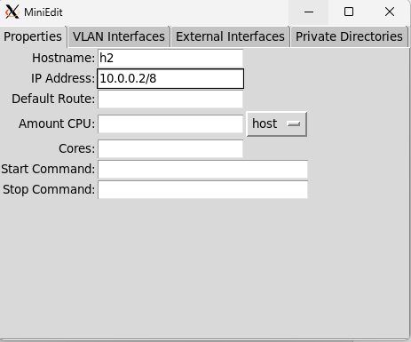{ #fig:019 width=80% height=80% }

## Построение и эмуляция сети в Mininet с использованием графического интерфейса

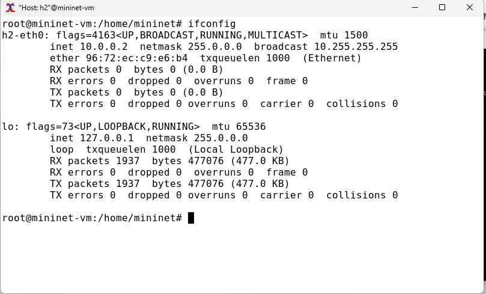{ #fig:020 width=80% height=80% }

## Построение и эмуляция сети в Mininet с использованием графического интерфейса

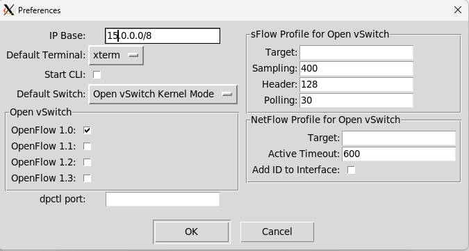{ #fig:021 width=80% height=80% }

## Построение и эмуляция сети в Mininet с использованием графического интерфейса

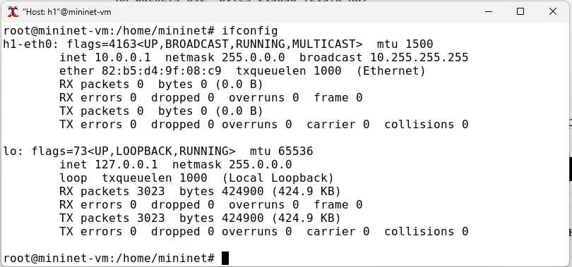{ #fig:022 width=80% height=80% }

## Построение и эмуляция сети в Mininet с использованием графического интерфейса

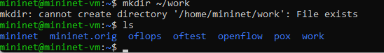{ #fig:023 width=100% height=100% }

## Построение и эмуляция сети в Mininet с использованием графического интерфейса

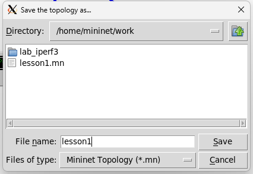{ #fig:024 width=80% height=80% }

## Построение и эмуляция сети в Mininet с использованием графического интерфейса

{ #fig:025 width=100% height=100% }

## Вывод

- В ходе выполнения лабораторной работы были получены навыки по развёртываню в системе виртуализации (например, в VirtualBox) 
mininet, а также познакомились с основными командами для работы с Mininet через командную строку и 
через графический интерфейс.

