---
## Front matter
title: "Отчёт по лабораторной работе №1

Моделирование сетей передачи данных"
subtitle: "Введение в Mininet"
author: "Выполнил: Исаев Булат Абубакарович, 

НПИбд-01-22, 1132227131"

## Generic otions
lang: ru-RU
toc-title: "Содержание"

## Bibliography
bibliography: bib/cite.bib
csl: pandoc/csl/gost-r-7-0-5-2008-numeric.csl

## Pdf output format
toc: true # Table of contents
toc-depth: 2
lof: true # List of figures
fontsize: 12pt
linestretch: 1.5
papersize: a4
documentclass: scrreprt
## I18n polyglossia
polyglossia-lang:
  name: russian
  options:
  - spelling=modern
  - babelshorthands=true
polyglossia-otherlangs:
  name: english
## I18n babel
babel-lang: russian
babel-otherlangs: english
## Fonts
mainfont: PT Serif
romanfont: PT Serif
sansfont: PT Sans
monofont: PT Mono
mainfontoptions: Ligatures=TeX
romanfontoptions: Ligatures=TeX
sansfontoptions: Ligatures=TeX,Scale=MatchLowercase
monofontoptions: Scale=MatchLowercase,Scale=0.9
## Biblatex
biblatex: true
biblio-style: "gost-numeric"
biblatexoptions:
  - parentracker=true
  - backend=biber
  - hyperref=auto
  - language=auto
  - autolang=other*
  - citestyle=gost-numeric
## Pandoc-crossref LaTeX customization
figureTitle: "Рис."
tableTitle: "Таблица"
listingTitle: "Листинг"
lofTitle: "Список иллюстраций"
lolTitle: "Листинги"
## Misc options
indent: true
header-includes:
  - \usepackage{indentfirst}
  - \usepackage{float} # keep figures where there are in the text
  - \floatplacement{figure}{H} # keep figures where there are in the text
---

# Цель работы

Основной целью работы является развёртывание в системе виртуализации (например, в VirtualBox) 
mininet, знакомство с основными командами для работы с Mininet через командную строку и 
через графический интерфейс.

# Выполнение лабораторной работы

##  Настройка образа VirtualBox

Для начала перейдём в репозиторий Mininet и скачаем актуальный релиз ovf-образа виртуальной машины. 
После чего запустим систему виртуализации и импортируем файл .ovf. Перейдём в настройки системы 
виртуализации и уточним параметры настройки виртуальной машины. В частности, для VirtualBox выберем
импортированную виртуальную машину и перейдите в меню "Машина"-"Настроить". Перейдём к опции 
«Система». Внизу этого окна есть сообщение об обнаружении неправильных настроек, следуя рекомендациям, 
внесём исправления. В настройках сети первый адаптер должен иметь тип подключения host-only network adapter
(виртуальный адаптер хоста), который в дальнейшем мы будем использовать для входа в образ виртуальной машины. 
В этом режиме адаптер хоста использует специальное устройство vboxnet0, создает подсеть и назначает
IP-адрес сетевой карте гостевой операционной системы. Запустим виртуальную машину с Mininet (рис. [-@fig:001]):

{ #fig:001 width=100% height=100% }

##  Подключение к виртуальной машине

Залогинемся в виртуальной машине и посмотрим её адрес (рис. [-@fig:002]):

{ #fig:002 width=100% height=100% }

Внутренний адрес машины 192.168.56.102, подключимся к виртуальной машине (из терминала хостовой машины). 
Для отключения ssh-соединения с виртуальной машиной нажмём Ctrl + d (рис. [-@fig:003]):

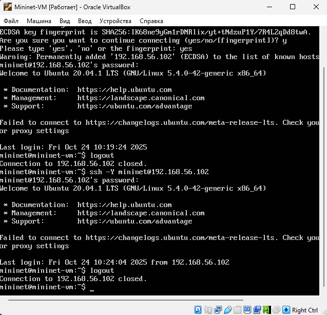{ #fig:003 width=100% height=100% }

## Работа с Mininet из-под Windows

Установим putty (рис. [-@fig:004]) и  VcXsrv Windows X Server (рис. [-@fig:005]):

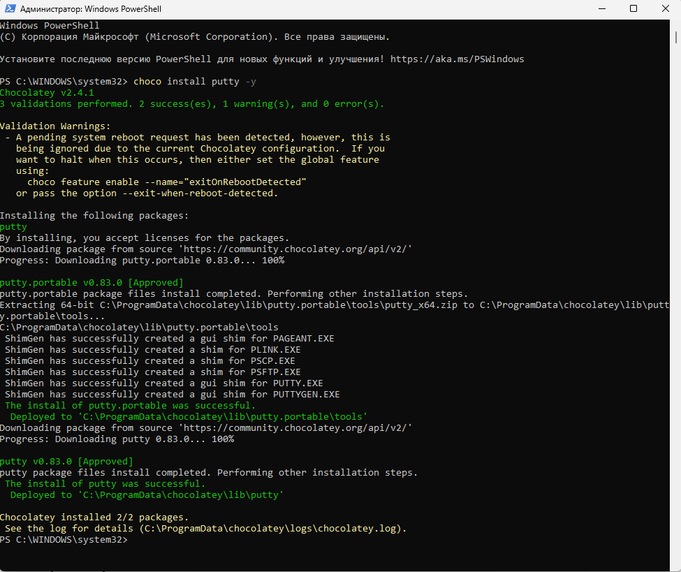{ #fig:004 width=100% height=100% }

{ #fig:005 width=100% height=100% }

Запустим Xserver. Выберем опции: multiple windows, display number: -1, start no client. Сохраним 
параметры, тогда при следующем запуске не нужно будет отмечать эти опции (рис. [-@fig:006]):

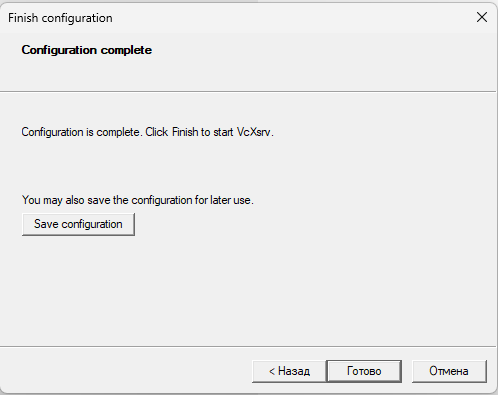{ #fig:006 width=100% height=100% }

Запустим putty. При подключении добавим опцию перенаправления X11 (рис. [-@fig:007]):

{ #fig:007 width=100% height=100% }

## Настройка параметров XTerm

По умолчанию XTerm использует растровые шрифты малого кегля. Для увеличения размера шрифта и 
применения векторных шрифтов вместо растровых необходимо внести изменения в файл 
/etc/X11/app-defaults/XTerm и в конце файла добавить нужные строки. Перед этим установим 
текстовый редактор mcedit (рис. [-@fig:008]):

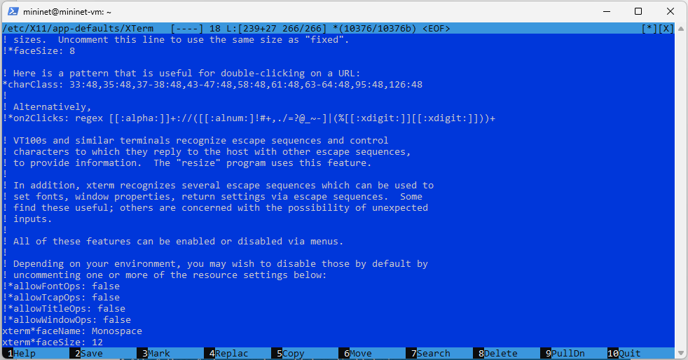{ #fig:008 width=100% height=100% }

## Настройка соединения X11 для суперпользователя

При попытке запуска приложения из-под суперпользователя возникает ошибка. Ошибка возникает 
из-за того, что X-соединение выполняется от имени пользователя mininet, а приложение запускается 
от имени пользователя root с использованием sudo. Для исправления этой ситуации необходимо заполнить 
файл полномочий /root/ .Xauthority, используя утилиту xauth. Скопируем значение куки (MIT magic cookie)1 
пользователя mininet в файл для пользователя root (рис. [-@fig:009]):

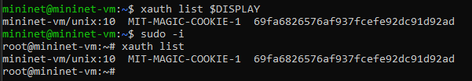{ #fig:009 width=100% height=100% }

## Работа с Mininet с помощью командной строки

Запустим минимальную топологию, состоящую из коммутатора, подключённого к двум хостам (рис. [-@fig:010]):

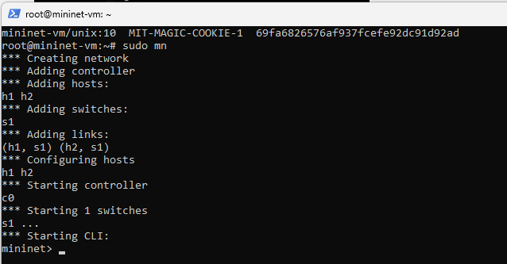{ #fig:010 width=100% height=100% }

Для отображения списка команд интерфейса командной строки Mininet и примеров их использования 
введём команду: help (рис. [-@fig:011]):

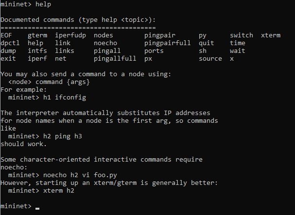{ #fig:011 width=100% height=100% }

Для отображения доступных узлов введём: nodes. Вывод этой команды показывает, что есть два хоста 
(хост h1 и хост h2) и коммутатор (s1) (рис. [-@fig:012]):

{ #fig:012 width=100% height=100% }

Иногда бывает полезно отобразить связи между устройствами в Mininet, чтобы понять топологию. 
Введём команду net в интерфейсе командной строки Mininet, чтобы просмотреть доступные линки (рис. [-@fig:013]):

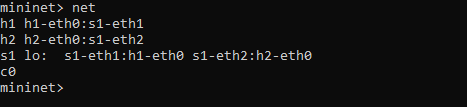{ #fig:013 width=100% height=100% }

Вывод этой команды показывает:
- Хост h1 подключён через свой сетевой интерфейс h1-eth0 к коммутатору на интерфейсе s1-eth1.
- Хост h2 подключён через свой сетевой интерфейс h2-eth0 к коммутатору на интерфейсе s1-eth2.
- Коммутатор s1:
  - имеет петлевой интерфейс lo.
  - подключается к h1-eth0 через интерфейс s1-eth1.
  - подключается к h2-eth0 через интерфейс s1-eth2.

Mininet позволяет выполнять команды на конкретном устройстве. Чтобы выполнить команду для 
определенного узла, необходимо сначала указать устройство, а затем команду (рис. [-@fig:014]):

{ #fig:014 width=100% height=100% }

Эта запись выполняет команду ifconfig на хосте h1 и показывает интерфейсы хоста h1 — хост h1 
имеет интерфейс h1-eth0, настроенный с IP-адресом 10.0.0.1, и другой интерфейс lo, 
настроенный с IP-адресом 127.0.0.1.

По умолчанию узлам h1 и h2 назначаются IP-адреса 10.0.0.1/8 и 10.0.0.2/8 соответственно. 
Чтобы проверить связь между ними, мы можем использовать команду ping (рис. [-@fig:015]):

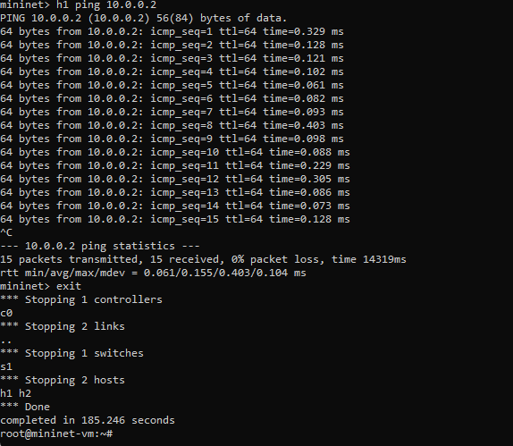{ #fig:015 width=100% height=100% }

Очистим предыдущий экземпляр Mininet (рис. [-@fig:016]):

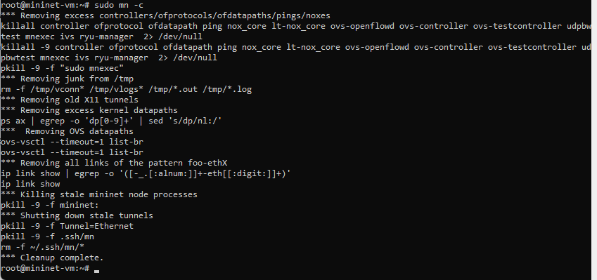{ #fig:016 width=100% height=100% }

## Построение и эмуляция сети в Mininet с использованием графического интерфейса

В терминале виртуальной машины mininet запустим MiniEdit: sudo ~/mininet/mininet/examples/miniedit.py

Добавим два хоста и один коммутатор, соединим хосты с коммутатором (рис. [-@fig:017]). Настроим IP-адреса на 
хостах h1 и h2. Для этого удерживая правую кнопку мыши на устройстве выберем свойства. 
Для хоста h1 укажем IP-адрес 10.0.0.1/8 (рис. [-@fig:018]), а для хоста h2 — 10.0.0.2/8 (рис. [-@fig:019]):

{ #fig:017 width=100% height=100% }

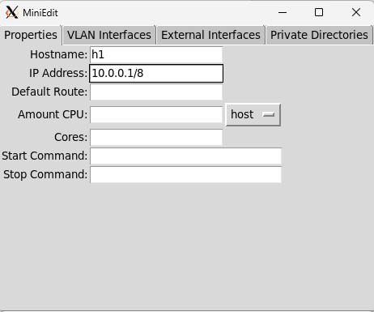{ #fig:018 width=100% height=100% }

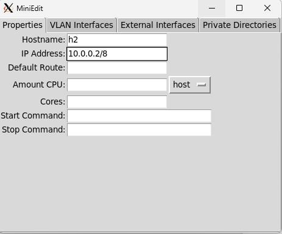{ #fig:019 width=100% height=100% }

Перед проверкой соединения между хостом h1 и хостом h2 необходимо запустить эмуляцию. 
Для запуска эмуляции нажмём кнопку Run. После начала эмуляции кнопки панели MiniEdit стали серыми, 
указывая на то, что в настоящее время они отключены.

Откроем терминал на хосте h2. На терминале хоста h1 введём команду ifconfig, чтобы отобразить 
назначенные ему IP-адреса. Интерфейс h1-eth0 на хосте h1 настроен с IP-адресом 10.0.0.1 и 
маской подсети 255.0.0.0. Повторим эти действия на хосте h2. Его интерфейс h2-eth0 настроен 
с IP-адресом 10.0.0.2 и маской подсети 255.0.0.0. Проверим соединение между хостами, 
введя в терминале хоста h2 команду ping 10.0.0.1. Для остановки теста нажмём Ctrl + c. 
Остановим эмуляцию, нажав кнопку Stop (рис. [-@fig:020]):

{ #fig:020 width=100% height=100% }

Ранее IP-адреса узлам h1 и h2 были назначены вручную. В качестве альтернативы можно полагаться 
на Mininet для автоматического назначения IP-адресов. Для этого удалим назначенный вручную 
IP-адрес с хостов h1 и h2. В MiniEdit нажмём Edit Preferences. По умолчанию в поле базовые значения IP-адресов 
(IP Base) установлено 10.0.0.0/8. Изменим это значение на 15.0.0.0/8. Затем запустим эмуляцию, нажав кнопку Run (рис. [-@fig:021]):

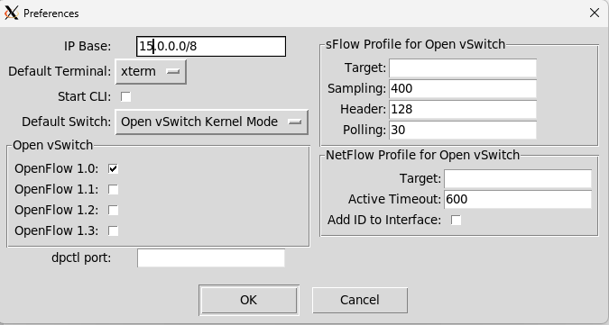{ #fig:021 width=100% height=100% }

Откроем терминал на хосте h1, удерживая правую кнопку мыши на хосте h1 и выбрав Terminal. Отобразим
IP-адреса, назначенные хосту h1. Интерфейс h1-eth0 на узле h1 теперь имеет IP-адрес 15.0.0.1 и маску 
подсети 255.0.0.0 (рис. [-@fig:022]):

{ #fig:022 width=100% height=100% }

В домашнем каталоге виртуальной машины mininet создадим каталог для работы с проектами mininet (рис. [-@fig:023]):

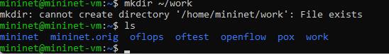{ #fig:023 width=100% height=100% }

Для сохранения топологии сети в файл нажмём в MiniEdit "File"-"Save". Укажем имя для топологии 
и сохраним на своём компьютере (рис. [-@fig:024]):

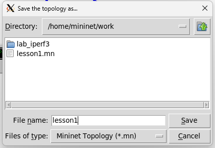{ #fig:024 width=100% height=100% }

После сохранения проекта поменяем права доступа к файлам в каталоге проекта (рис. [-@fig:025]):

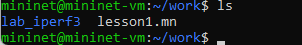{ #fig:025 width=100% height=100% }

# Вывод

В ходе выполнения лабораторной работы были получены навыки по развёртываню в системе виртуализации (например, в VirtualBox) 
mininet, а также познакомились с основными командами для работы с Mininet через командную строку и 
через графический интерфейс.

# Список литературы. Библиография

[1] Mininet: https://mininet.org/

