---
## Front matter
lang: ru-RU
title: Лабораторная работа №3
subtitle: Моделирование сетей передачи данных
author:
  - Исаев Б.А.
institute:
  - Российский университет дружбы народов имени Патриса Лумумбы, Москва, Россия
date: 2024

## i18n babel
babel-lang: russian
babel-otherlangs: english

## Formatting pdf
toc: false
toc-title: Содержание
slide_level: 2
aspectratio: 169
section-titles: true
theme: metropolis
header-includes:
 - \metroset{progressbar=frametitle,sectionpage=progressbar,numbering=fraction}
 - '\makeatletter'
 - '\beamer@ignorenonframefalse'
 - '\makeatother'
---

## Докладчик

  * Исаев Булат Абубакарович
  * Студент группы НПИбд-01-22
  * Студ. билет 1132227131
  * Российский университет дружбы народов имени Патриса Лумумбы

## Цель лабораторной работы

- Познакомиться с инструментом для измерения пропускной способности 
сети в режиме реального времени — iPerf3, а также получить навыки проведения воспроизводимого 
эксперимента по измерению пропускной способности моделируемой сети в среде Mininet.

## Создание простейшей топологии сети

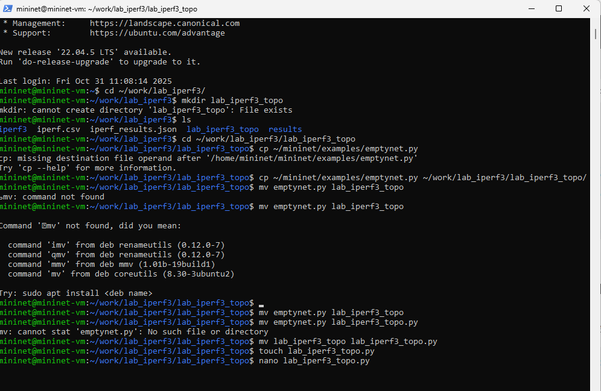{ #fig:001 width=100% height=100% }

## Создание простейшей топологии сети

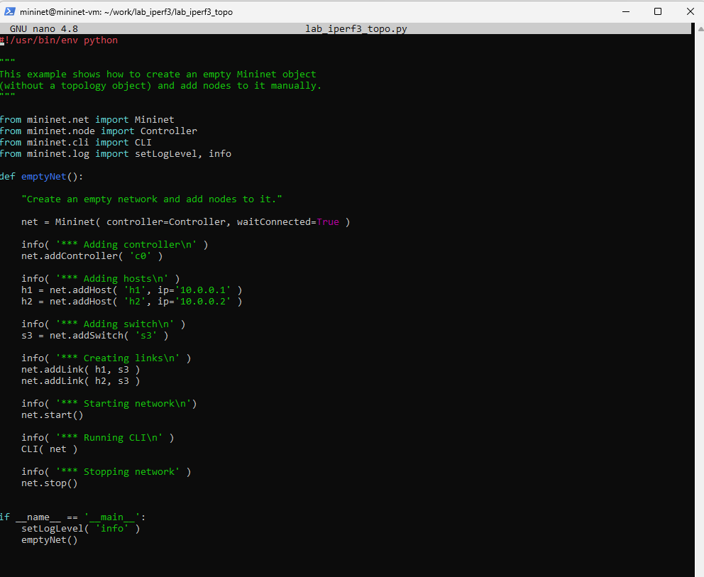{ #fig:002 width=80% height=80% }

## Создание простейшей топологии сети

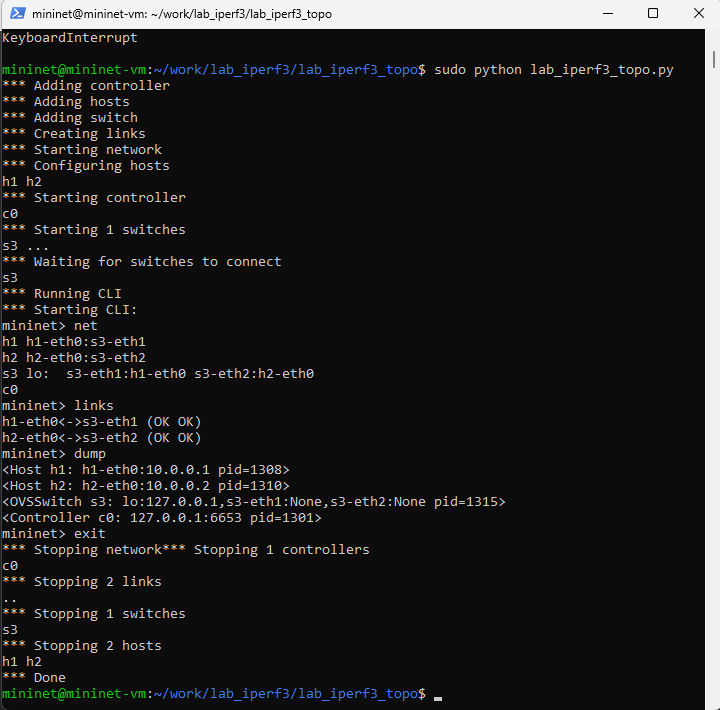{ #fig:003 width=80% height=80% }

## Внесение изменений в скрипт

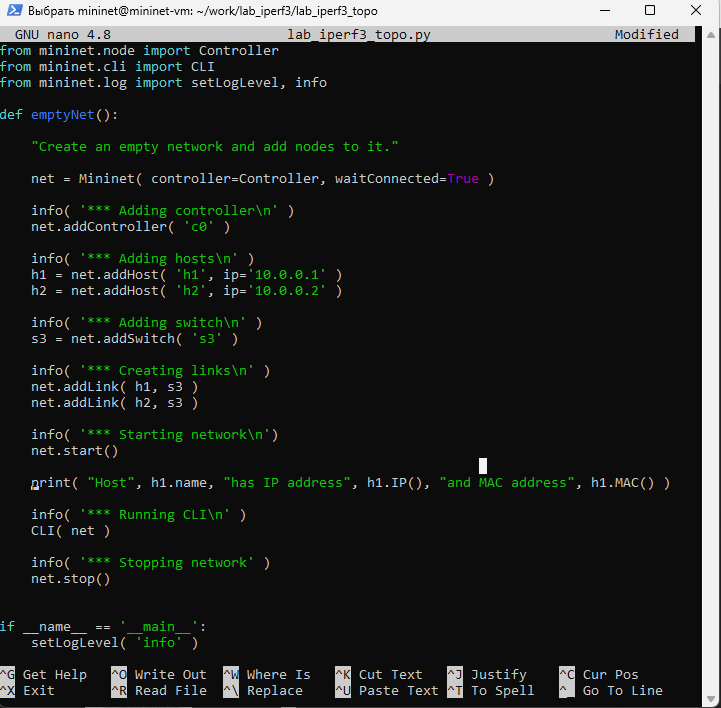{ #fig:004 width=80% height=80% }

## Проверка

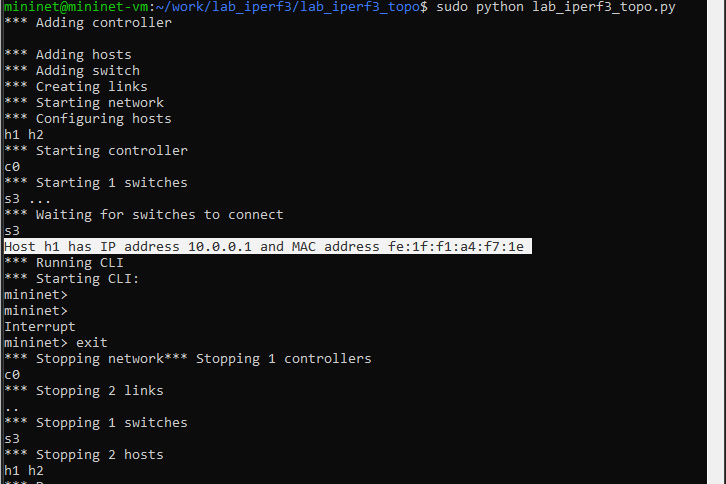{ #fig:005 width=80% height=80% }

## Внесение изменений в скрипт

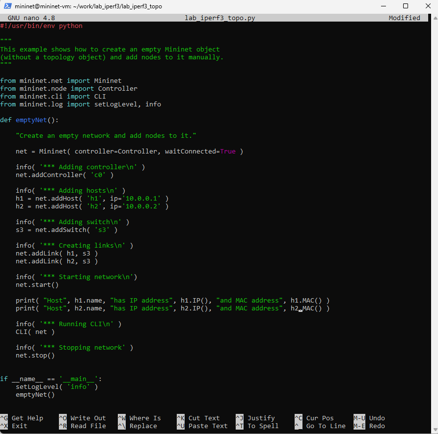{ #fig:006 width=80% height=80% }

## Проверка

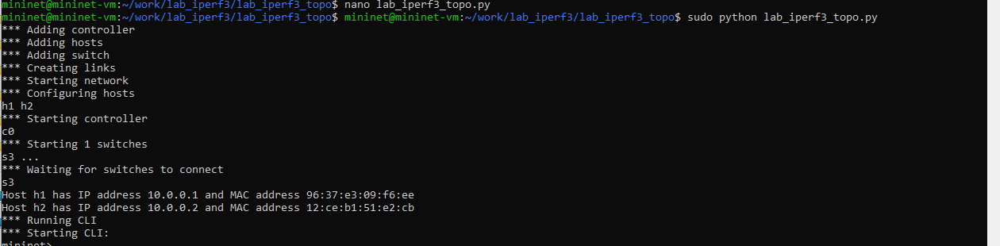{ #fig:007 width=80% height=80% }

## Добавление в скрипт настроек параметров производительности

{ #fig:008 width=100% height=100% }

## Добавление в скрипт настроек параметров производительности

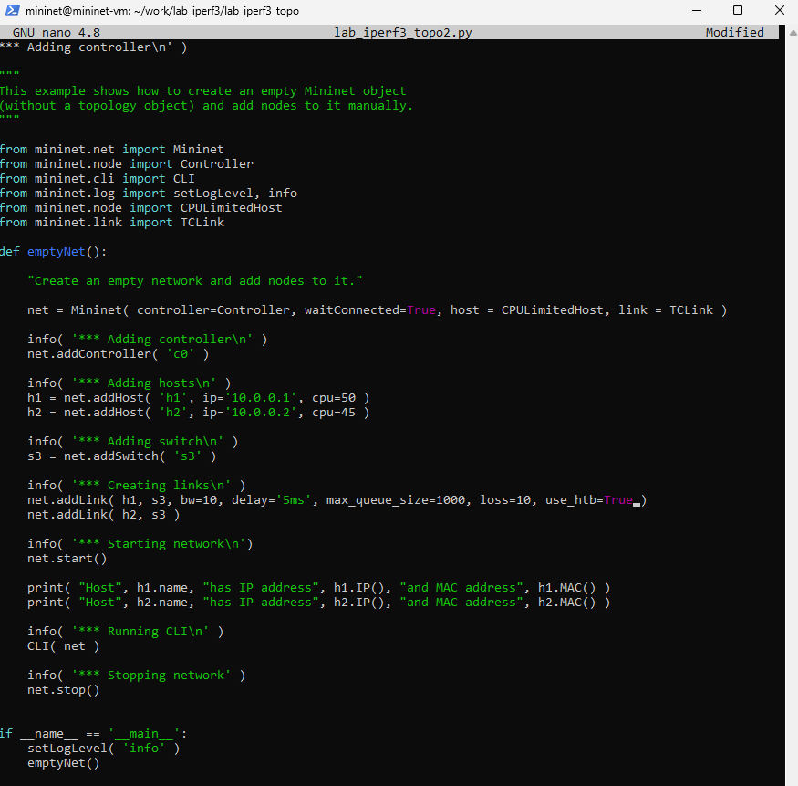{ #fig:009 width=70% height=70% }

## Добавление в скрипт настроек параметров производительности

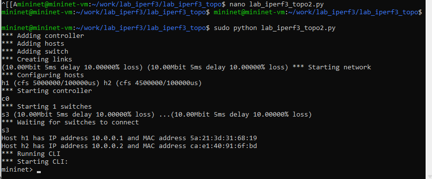{ #fig:010 width=80% height=80% }

## Добавление в скрипт настроек параметров производительности

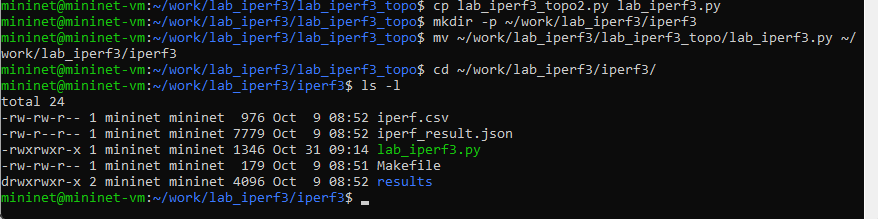{ #fig:011 width=100% height=100% }

## Добавление в скрипт настроек параметров производительности

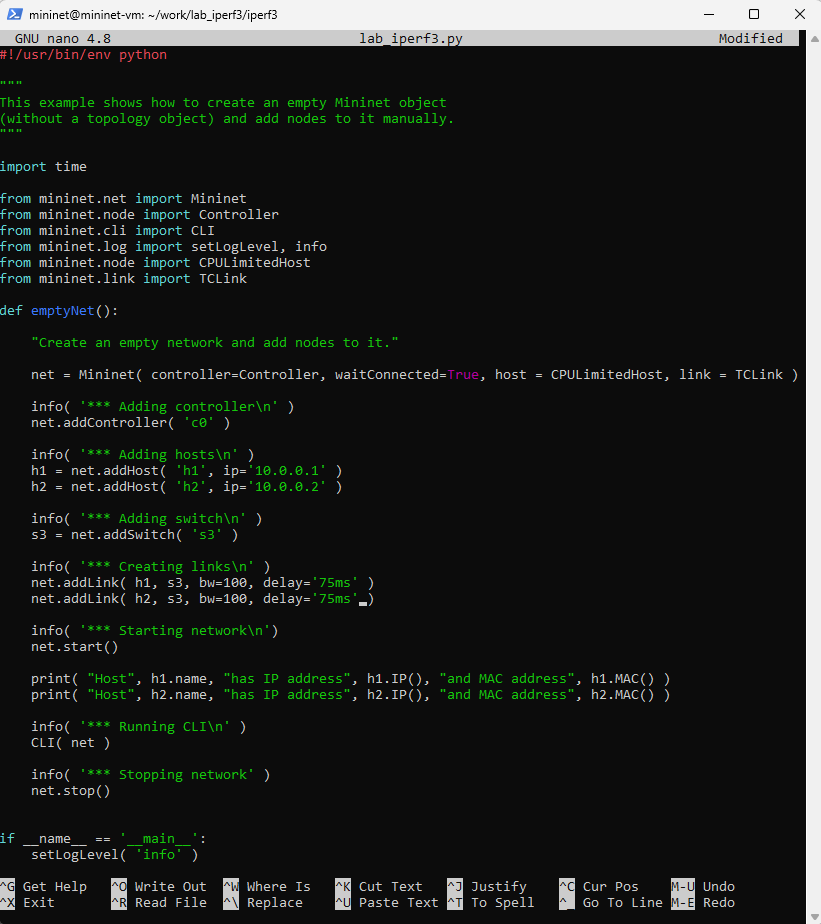{ #fig:012 width=70% height=70% }

## Добавление в скрипт настроек параметров производительности

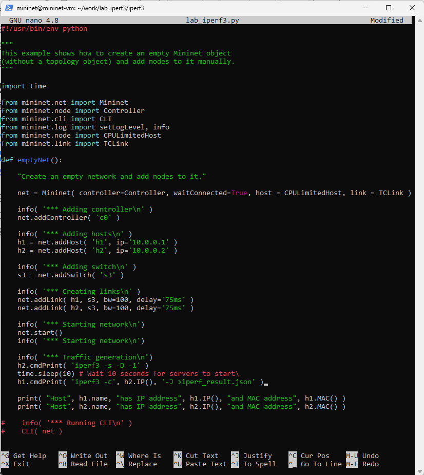{ #fig:013 width=70% height=70% }

## Добавление в скрипт настроек параметров производительности

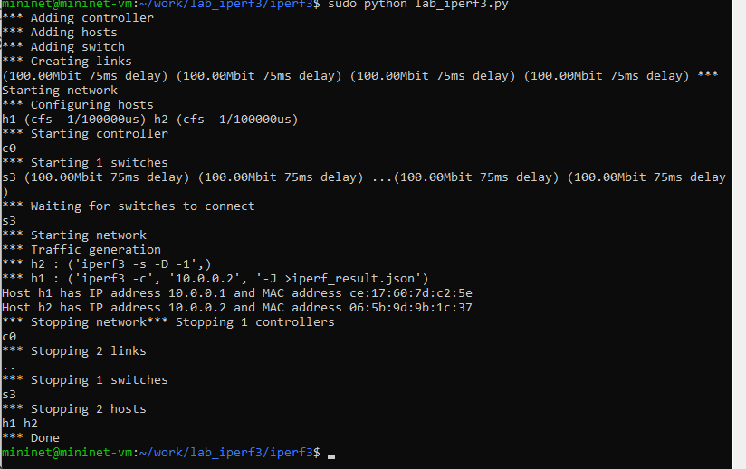{ #fig:014 width=80% height=80% }

## Построение графиков по проводимому эксперименту

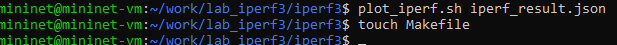{ #fig:015 width=100% height=100% }

## Построение графиков по проводимому эксперименту

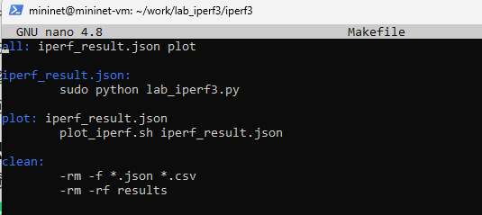{ #fig:016 width=100% height=100% }

## Построение графиков по проводимому эксперименту

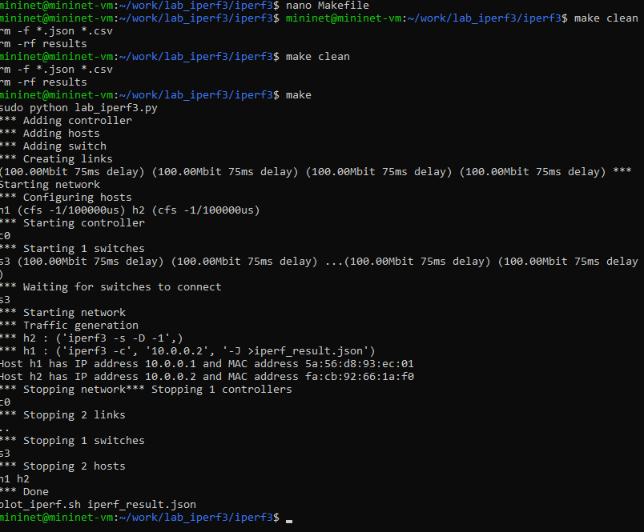{ #fig:017 width=80% height=80% }

## Вывод

- В ходе выполнения лабораторной работы познакомились с инструментом для измерения пропускной способности 
сети в режиме реального времени — iPerf3, а также получили навыки проведения воспроизводимого 
эксперимента по измерению пропускной способности моделируемой сети в среде Mininet

